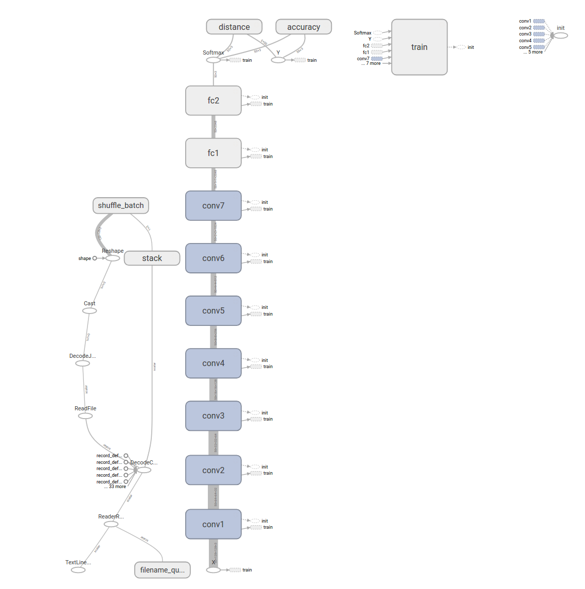
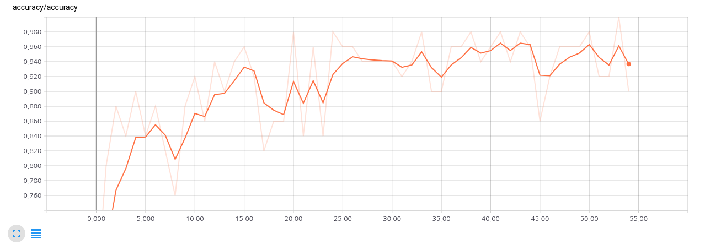
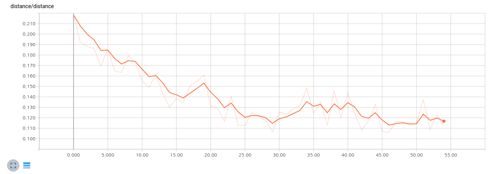
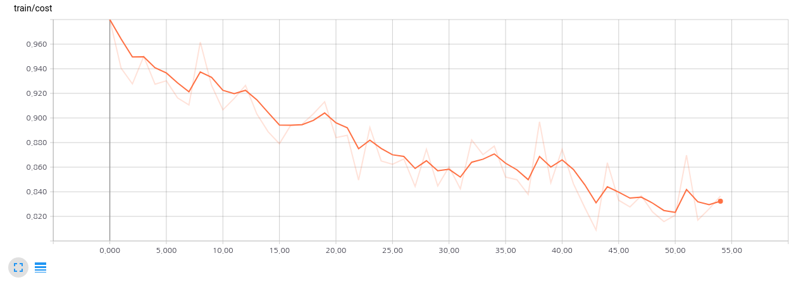
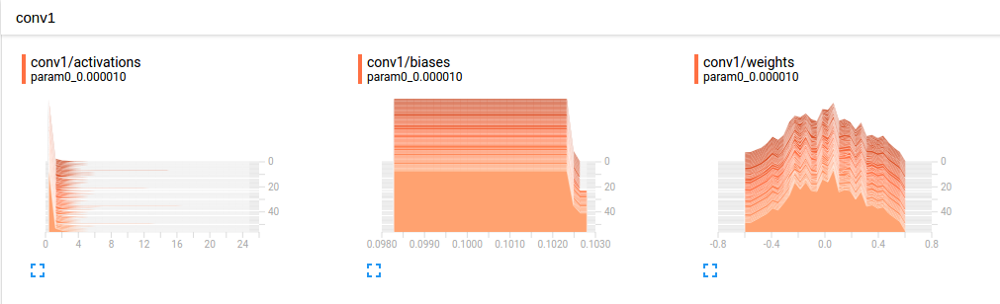
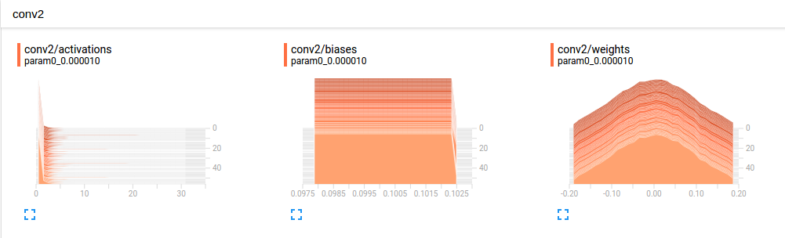
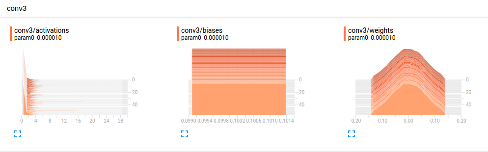
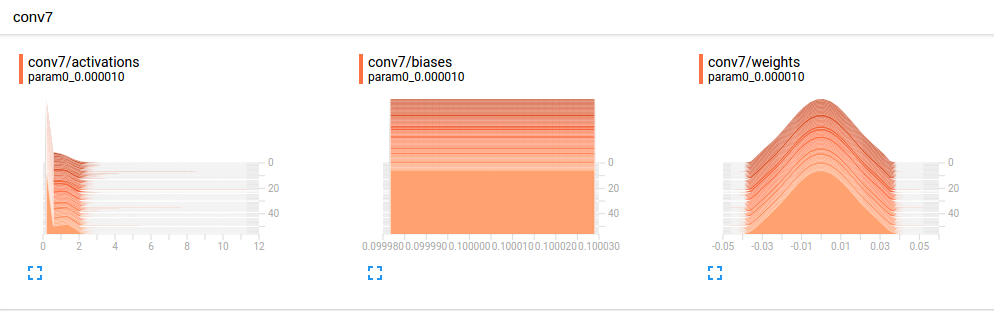
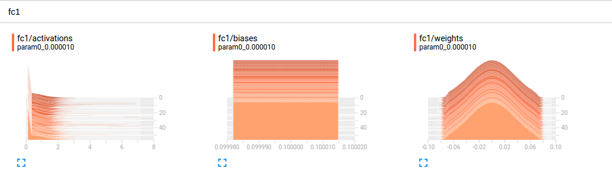
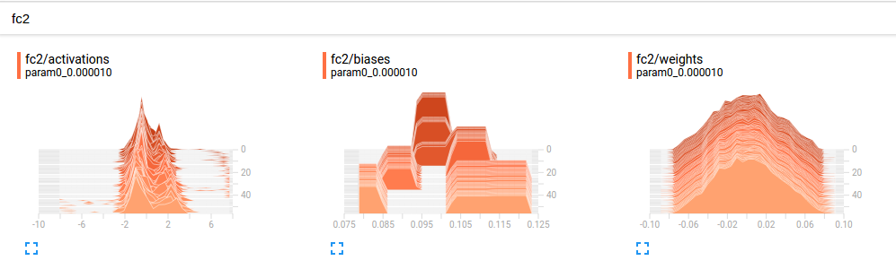

# Model

## Introduction

본 연구는 Kaggle의 SDSS 외부은하 사진의 type 분류를 위한 citizeon science(galaxy zoo)를 결과를 중심으로 Decision Tree의 각 leaf의 answer 확률 유추에 Regression이 잘 되는지를 확인하는 것을 목적으로 한다. **그 중 이 문서는 이 문제를 해결하기 위해 CNN을 사용하였고, Decision Tree 중 첫번째 트리에 대해서만 Regression 예측을 수행한 결과를 바탕으로 CNN이 정상동작됨을 보이고, 그 모델에 대한 구조를 설명한다.**

- TensorFlow 1.1을 기반으로 개발하였음
- TensorBoard를 통해 각 변수들의 상태를 실시간으로 확인하였음
에
## Model

전체적인 모델은 다음과 같다. CNN을 기반으로 개발하였고, Fully Convolutional Network을 기본으로 하여 모델을 개발하였다.



코드적으로는 다음과 같다. 우선 RGB 입력 영상을 받아 convolution layer을 7번 거치고 FC (fully connected Layer)를 2번 사용하였다. 그리고 Y값이 전체 합이 1이 되도록 되어 있는 구조라 softmax를 통해 확률값으로 변경하도록 하였다.

```python
 # Graph 
conv1 = conv_layer(X, 3, 32, name='conv1')
conv2 = conv_layer(conv1, 32, 64, name='conv2')
conv3 = conv_layer(conv2, 64, 128, name='conv3')
conv4 = conv_layer(conv3, 128, 256, name='conv4')
conv5 = conv_layer(conv4, 256, 512, name='conv5')
conv6 = conv_layer(conv5, 512, 1024, name='conv6')
conv7 = conv_layer(conv6, 1024, 2048, name='conv7')
fc1   = fc_layer(conv7, 2048, 2048, name='fc1')
fc2   = fc_layer(fc1, 2048, NUM_CLASSES, is_relu=False, name='fc2')
logits = tf.nn.softmax(fc2, name=None)
```

각 conv는 (conv-bn-relu-maxpool) 구조로 이루어져있으며, 코드는 다음과 같다.
```python
def conv_layer(input, size_in, size_out, name="conv"):
  with tf.name_scope(name):
    w_init = tf.contrib.layers.variance_scaling_initializer()
    w = tf.get_variable(name+"_w", shape=[FILTER_SIZE, FILTER_SIZE, size_in, size_out], initializer=w_init)
    b = tf.Variable(tf.constant(0.1, shape=[size_out]), name="b")
    conv = tf.nn.conv2d(input, w, strides=[1, 1, 1, 1], padding="SAME")
    h1 = conv + b
    h2 = tf.contrib.layers.batch_norm(h1, center=True, scale=True, is_training=True, scope=name)
    act = tf.nn.relu(h2, 'relu')
    tf.summary.histogram("weights", w)
    tf.summary.histogram("biases", b)
    tf.summary.histogram("activations", act)
    return tf.nn.max_pool(act, ksize=[1, POOLING_SIZE, POOLING_SIZE, 1], strides=[1, 2, 2, 1], padding="SAME")

```

초기화를 위해 Keming He의 방식을 사용하였고, BN(batch normalization)을 사용하였다. 특히 BN을 사용할때와 안할때의 차이가 극명하였다. 예를 들어 BN을 사용하지 않은 경우 weight 초기화 문제로 잘 되는 경우와 안되는 경우가 있었어 예측하기 어려웠지만, BN을 추가하니 그런 문제가 사라졌다.

conv와 마찬가지로 fc또한 같은 방법을 사용하였으며 단 마지막 logit을 계산할때는 relu를 사용하지 않기 때문에 인자값에 relu 사용 유무를 설정하도록 하였다.

```python
def fc_layer(input, size_in, size_out, is_relu=True, name="fc"):
  with tf.name_scope(name):
    flat_input = tf.reshape(input, [-1, size_in])
    w_init = tf.contrib.layers.variance_scaling_initializer()
    w = tf.get_variable(name+"_w", shape=[size_in, size_out], initializer=w_init)
    b = tf.Variable(tf.constant(0.1, shape=[size_out]), name="b")
    h1  = tf.matmul(flat_input, w) + b
    h2 = tf.contrib.layers.batch_norm(h1, center=True, scale=True, is_training=True, scope=name)
    if is_relu :
	act = tf.nn.relu(h2, 'relu')
    else :
	act = h2
    tf.summary.histogram("weights", w)
    tf.summary.histogram("biases", b)
    tf.summary.histogram("activations", act)
    return act
```

learning rate은 1e-5로 수행하였다.  BN(Batch Normalization)을 하지 않은 경우 1e-6으로 해야 어느 정도(50% 만 정상동작) 동작했지만, BN 적용 후에는 learning rate을 올려도 정상 동작 하였다. Optimazier로는 Adam Optimizer 사용하였다.

## How to use TensorBoard

tensorboard를 사용하기 위해서 필요 변수에 대해 histogram 혹은 scalar 방식으로 모니터링이 가능하다. 만약 w라는 변수에 대해 histogram으로 모니터링을 하고 싶은 경우 `tf.summary.histogram("weights", w)` 와 같이 하면 되고,  cost에 대해 scalar 방식으로 모니터링하고 싶은 경우 `cost_scalar = tf.summary.scalar('cost', cost) ` 라고 하면된다.
이후 초기에 다음과 같이 설정을 해주고, summary와 writer에 대해 run함수를 이용하여 업데이틀 해주면 기록이 된다.
```python
summary  = tf.summary.merge_all()
writer = tf.summary.FileWriter('logs/'+hparam)
writer.add_graph(sess.graph)
```
 tensorboard 동작 방식은 다음과 같다.
```bash
$ tensorboard --logdir=[logdirectory 위치] --port=[번호,Option,Default=6006]
```

## Test Result

시험을 위해 입력 값은 61578개를 사용하였고, batch size는 50개로 하였다. epoch는 500으로 하였지만, 본 시험 결과는 중간에 나온 값으로 약 50 epoch 수행 결과이다. 그외 입력에 대한 설정값은 다음과 같다.

```
IMAGE_WIDTH =  128
IMAGE_HEIGHT = 128
TRAIN_EPOCH = 500
BATCH_SIZE = 50
NUM_TOTAL_TRAINING_DATA = 61578
NUM_THREADS = 4
CAPACITY = 50000
MIN_AFTER_DEQUEUE = 100
NUM_CLASSES = 3
FILTER_SIZE = 3
POOLING_SIZE = 2
```

수행 결과는 다음과 같다.


distance는 logit($\hat Y$)값과 Y값의 차이를 나타내는 것으로써 다음과 같다.

$$ \frac{1}{n} \sum_{i=0}^n \sqrt{(\hat Y - Y)^2}  $$




한편, 이때 weight값을 비교해보면 다음과 같다.
conv1의 경우는 weight값이 많은 변화가 발생하고 있음을 알수 있다.

conv2를 보면 weight가 conv1에 비해 많은 변화량이 없음을 확인할 수 있다.

이는 conv3~conv7까지 두드러진다. 아직 정확하지는 않지만, conv7의 경우를 보면 큰 변화가 없는 것을 미루어보아 학습이 거의 되지 않은 것 같고, 즉 layer가 너무 깊은게 아닌가 싶다.



fc쪽으로 넘어가면 초기 fc1의 경우 큰 변화가 없지만, fc2가 되면 많은 변화가 발생하고 있음을 볼 수 있다.

즉 fc2에서 학습이 많이 되는 것으로 예측된다.


## Test

시험을 위해 1000개 입력값에 대해 시험을 하였다.

### Test #1 (TODO)
- 목적: Batch Normalization을 수행한 경우와 안한 경우 테스트

### Test #2 (TODO)
- 목적: Color 영상과 Gray 영상를 입력으로 한 경우 성능 측정

### Test #3 (TODO)
- 목적: Convolution Layer의 갯수를 얼마까지 줄여도 되는지 성능 측정

### Test #4 (TODO)
- 목적: 

## Reference
[1] [Sander Dieleman (1st)](https://github.com/benanne/kaggle-galaxies)
[2] [Tund (3rd)](https://github.com/tund/kaggle-galaxy-zoo)
